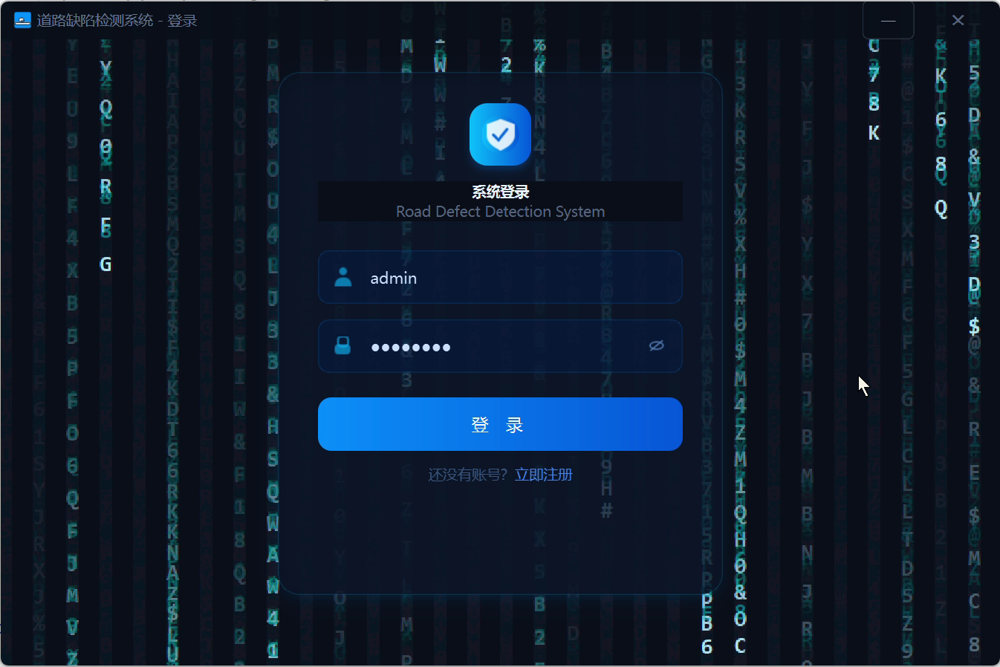
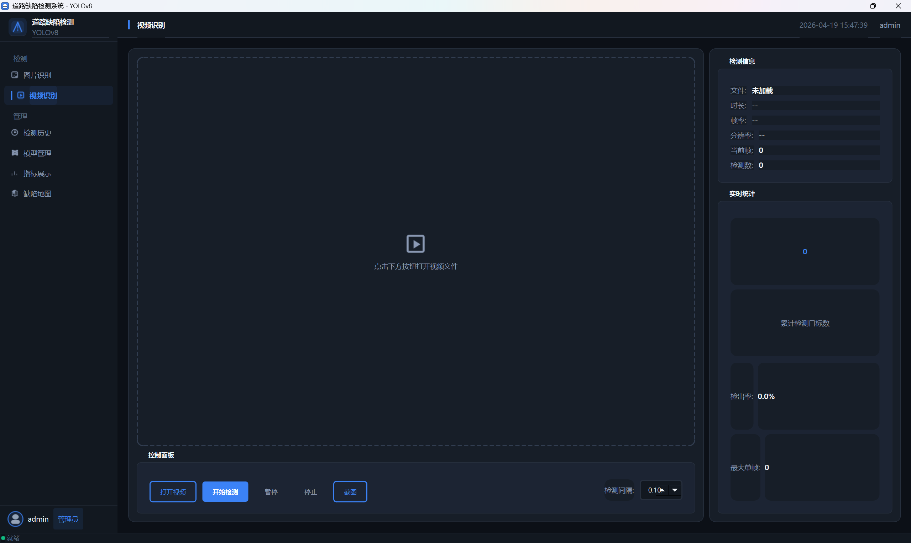
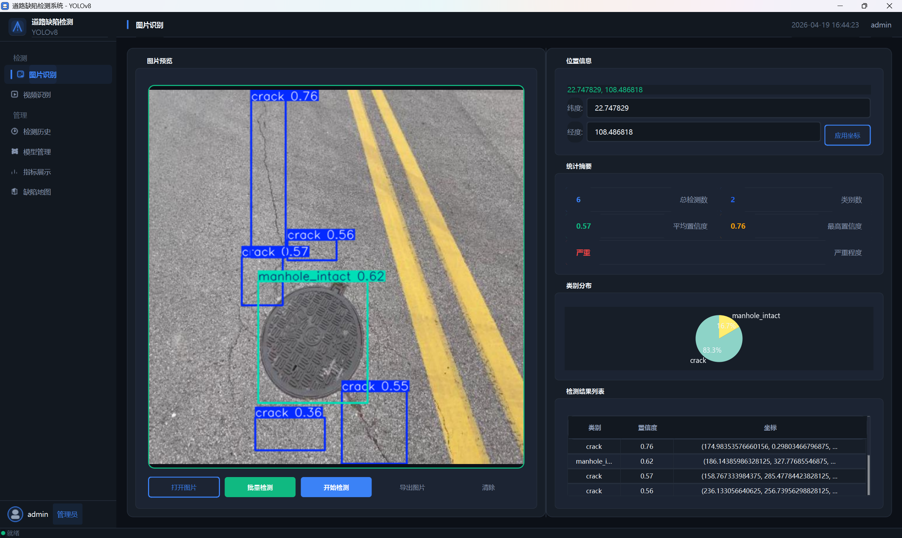
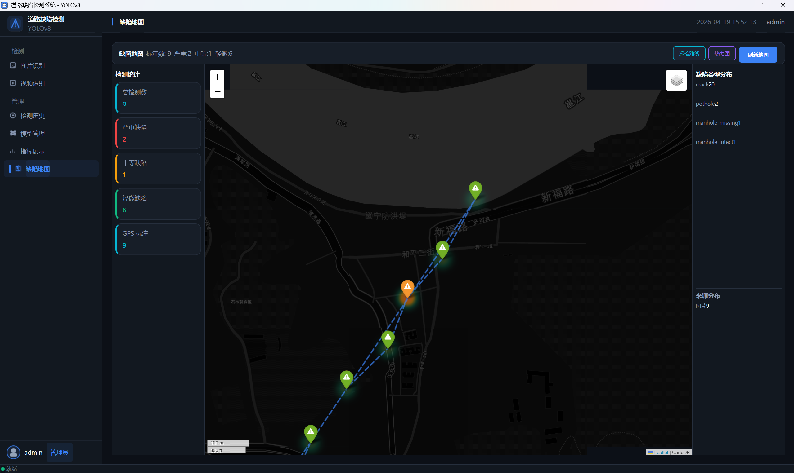
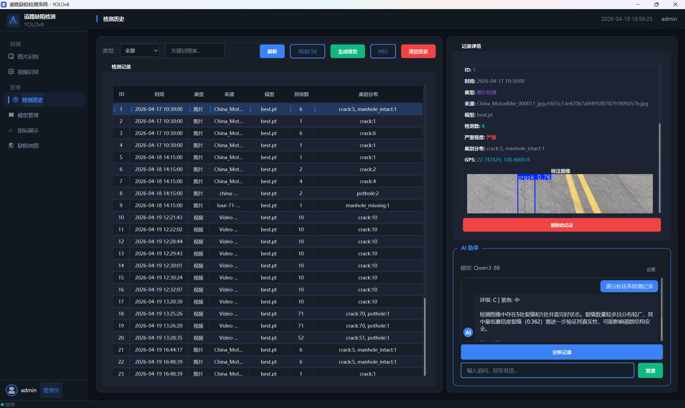
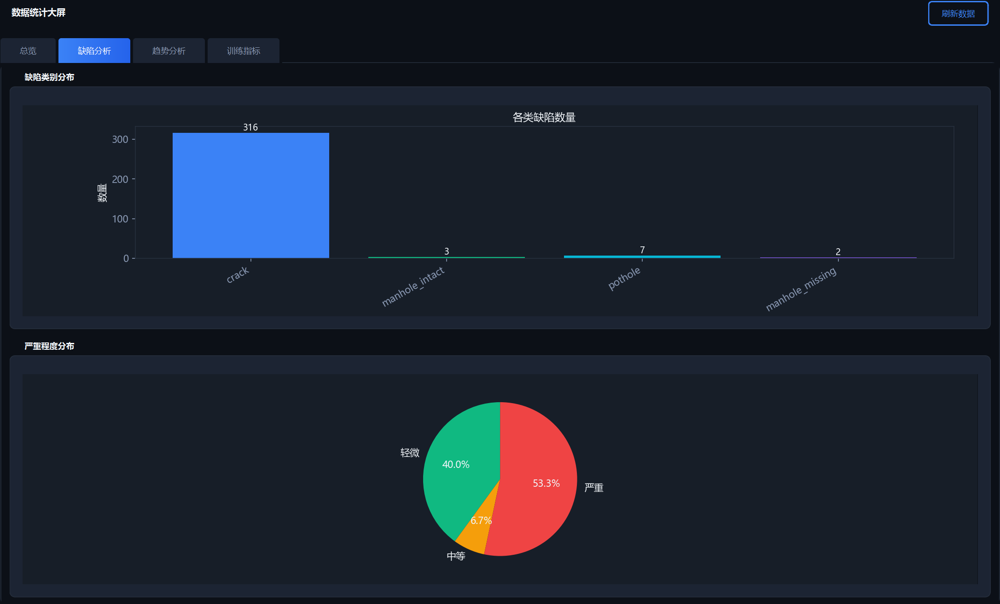
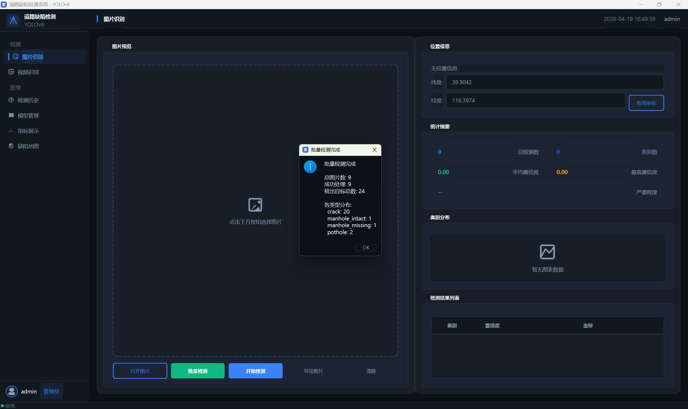
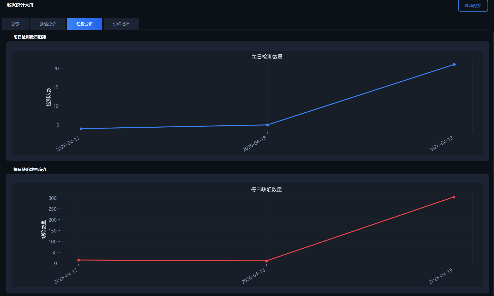

<div align="center">

# RoadDefectSystem

**基于 YOLOv8 的道路缺陷智能检测系统**

面向道路巡检场景，集成计算机视觉检测、LLM 智能分析、GIS 地图可视化、
数据统计大屏于一体的 PyQt6 桌面应用。

[](https://www.python.org/)
[](https://www.riverbankcomputing.com/software/pyqt/)
[](https://docs.ultralytics.com/)
[](LICENSE)

</div>

---

## 系统展示

<table>
  <tr>
    <td align="center"><b>登录页 — Matrix 数字雨动画</b></td>
    <td align="center"><b>图片缺陷检测</b></td>
  </tr>
  <tr>
    <td></td>
    <td></td>
  </tr>
  <tr>
    <td align="center"><b>GIS 缺陷地图 + 巡检路线</b></td>
    <td align="center"><b>检测结果对比分析</b></td>
  </tr>
  <tr>
    <td></td>
    <td></td>
  </tr>
  <tr>
    <td align="center"><b>检测历史管理</b></td>
    <td align="center"><b>统计大屏 — 缺陷分析</b></td>
  </tr>
  <tr>
    <td></td>
    <td></td>
  </tr>
</table>

<details>
<summary>更多截图</summary>

| 视频检测 | 趋势分析 |
|:---:|:---:|
|  |  |

</details>

---

## 核心功能

### 计算机视觉检测
- **9 类道路缺陷识别**：Crack、Pothole、Net、Manhole、Patch-Crack、Patch-Net、Patch-Pothole 等
- **多模态输入**：支持单张图片、批量图片、视频文件检测
- **IoU 跨帧追踪**：视频模式下基于 IoU 的跨帧去重，统计唯一目标，避免重复计数
- **模型管理**：动态加载/切换 YOLOv8 模型，可调节置信度阈值、IoU 阈值、最大检测数，支持 CPU / CUDA 推理切换

### LLM 智能分析
- 集成 OpenAI 兼容 API（SiliconFlow Qwen3-8B），对检测结果进行智能分析
- 自动生成缺陷评级（A-E）、紧急程度评估、原因分析、维修建议
- 支持多轮对话，可追问缺陷细节

### GIS 地图可视化
- 基于 Folium + QWebEngineView 的交互式地图
- CartoDB 深色底图，支持 MarkerCluster 标注聚合、PolyLine 巡检路线、HeatMap 热力图
- 自动提取图片 EXIF GPS 信息，按严重度着色标注
- 适配国内网络：CDN 资源替换为 jsdelivr，地图瓦片固定子域加载

### 数据统计大屏
- **总览面板**：核心指标卡片 + 缺陷类型饼图 + 来源分布
- **缺陷分析**：按类别/严重度的柱状图与饼图
- **趋势分析**：检测数量时间序列折线图、各类缺陷趋势
- **训练指标**：支持导入 YOLO 训练日志，展示 Loss / mAP / Precision / Recall 曲线

### 检测历史管理
- SQLite 数据库存储，支持 Schema 自动迁移
- 搜索、筛选、CSV 导出（含 GPS 列）
- 检测结果对比：任意两条记录并排对比，含变化趋势分析
- PDF 巡检报告：一键生成带图片、统计、严重度的专业报告

---

## 技术架构

```
┌──────────────────────────────────────────────────────┐
│                    PyQt6 MainWindow                    │
│  ┌─────────┬──────────┬──────────┬─────────────────┐ │
│  │ 图片检测  │ 视频检测  │ 检测历史  │ 缺陷地图/统计大屏│ │
│  └────┬────┴────┬─────┴────┬────┴────────┬──────────┘ │
│       │         │          │             │            │
│  ┌────▼─────────▼──────────▼─────────────▼──────────┐ │
│  │              core / utils 层                       │ │
│  │  ┌──────────┐ ┌───────────┐ ┌──────────────────┐ │ │
│  │  │ Detector │ │  Tracker  │ │   AI Analyzer    │ │ │
│  │  │ (YOLOv8) │ │ (IoU 追踪) │ │ (Qwen3-8B LLM)  │ │ │
│  │  └──────────┘ └───────────┘ └──────────────────┘ │ │
│  │  ┌──────────────────────────────────────────────┐ │ │
│  │  │  DatabaseManager (SQLite + Migration)        │ │ │
│  │  └──────────────────────────────────────────────┘ │ │
│  └───────────────────────────────────────────────────┘ │
│  ┌───────────────────────────────────────────────────┐ │
│  │  styles.py — 深色主题设计系统 (27 色彩令牌)         │ │
│  └───────────────────────────────────────────────────┘ │
└──────────────────────────────────────────────────────┘
```

### 设计亮点

| 设计决策 | 实现方式 |
|---------|---------|
| 单例检测器 | `Detector` 类全局唯一实例，避免模型重复加载 |
| 设计令牌系统 | `styles.py` 集中管理 27 个色彩令牌、8 个圆角、6 个间距，全局统一 |
| 程序化图标 | QPainter 动态渲染导航图标，零外部图标文件依赖 |
| 数据库迁移 | `db_manager.py` 内置 Schema 版本检测 + 自动 `ALTER TABLE` |
| 视频去重 | IoU 阈值追踪器，跨帧关联同一物理目标 |
| 严重度评估 | 根据检测目标数量自动分级（轻微/中等/严重），三级着色 |
| 中国网络适配 | jQuery CDN → jsdelivr，CartoDB 瓦片固定 `b` 子域，白闪预加载 |

---

## 技术栈

| 分类 | 技术 |
|------|------|
| 语言 | Python 3.13 |
| 深度学习 | PyTorch + Ultralytics YOLOv8 |
| GUI 框架 | PyQt6 + QWebEngineView |
| 图像处理 | OpenCV、Pillow、piexif |
| 数据可视化 | Matplotlib (FigureCanvasQTAgg) |
| 地图引擎 | Folium + CartoDB dark_matter |
| 数据库 | SQLite3 |
| AI 分析 | SiliconFlow Qwen3-8B (OpenAI 兼容 API) |
| 报告生成 | python-docx |

---

## 快速开始

### 环境要求

- Python 3.10+
- 推荐 CUDA 11.8+（GPU 推理，CPU 也可运行）

### 安装运行

```bash
# 克隆项目
git clone https://github.com/your-username/RoadDefectSystem.git
cd RoadDefectSystem/road_defect_system

# 安装依赖
pip install -r requirements.txt

# 启动
python main.py
```

默认登录账号：`admin` / `admin123`

### AI 分析配置（可选）

进入「模型管理」页面配置 AI 分析接口，或编辑 `config/ai_config.json`：

```json
{
  "api_key": "your-api-key",
  "base_url": "https://api.siliconflow.cn/v1",
  "model": "Qwen/Qwen3-8B"
}
```

---

## 项目结构

```
├── img/                            # 项目截图
└── road_defect_system/             # 项目源码
    ├── main.py                     # 程序入口
├── styles.py                   # 深色主题设计令牌系统
├── requirements.txt
├── .gitignore
├── config/
│   └── ai_config.json          # AI 分析 API 配置
├── core/
│   ├── detector.py             # YOLOv8 单例检测器
│   ├── ai_analyzer.py          # LLM 大模型集成
│   ├── tracker.py              # IoU 跨帧追踪器
│   └── visualizer.py           # Matplotlib 图表工具
├── database/
│   ├── db_manager.py           # SQLite 管理器（含迁移）
│   └── models.py               # 数据模型定义
├── ui/
│   ├── main_window.py          # 主窗口（6 页导航）
│   ├── login_dialog.py         # 登录对话框（数字雨动画）
│   ├── detect_image_page.py    # 图片检测页
│   ├── detect_video_page.py    # 视频检测页
│   ├── history_page.py         # 检测历史 + AI 助手 + PDF 报告
│   ├── model_manage_page.py    # 模型管理页
│   ├── metrics_page.py         # 统计大屏（4 Tab）
│   ├── map_page.py             # GIS 缺陷地图
│   └── ai_config_dialog.py     # AI 配置对话框
├── utils/
│   ├── file_utils.py           # 文件操作工具
│   ├── image_utils.py          # 图像处理 + GPS EXIF 提取
│   └── inject_gps.py           # GPS 注入开发工具
├── models/
│   └── best.pt                 # 训练好的 YOLOv8 模型
└── img/                        # 截图资源
```

> **注意**：项目代码在 `road_defect_system/` 子目录中，`img/` 为项目截图。
```

---

## 数据集

**N-RDD2024 Road Damage and Defects**（China_MotorBike 子集）

来自 [Roboflow Universe](https://universe.roboflow.com/) 公开数据集，包含 9 类道路缺陷标注。

---

## License

MIT License
